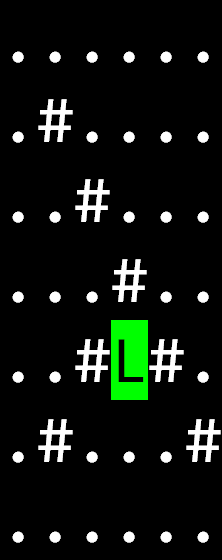
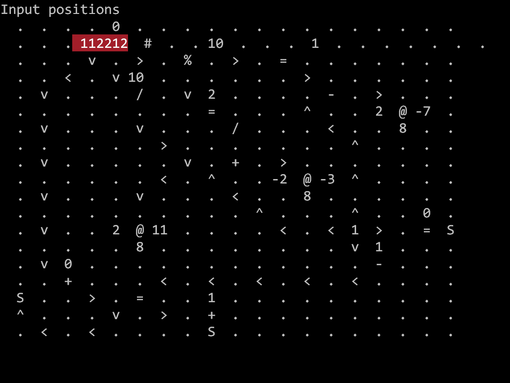

# Team uguu.org

One person team, using primarily C++.

`src` contains full round artifacts.  `lightning` is the state of the repository at the end of the lightning round.

## TL;DR

1. Rewrite the evaluator a few times until it eventually passed the language test (~10 hours).
2. Solve Lambdaman with a greedy strategy (~2.5 hours).
3. Solve Spaceship with a greedy strategy (~0.5 hours).
4. Rewrite the evaluator a few more times for efficiency (~8 hours).
5. Give up and solve efficiency problems by hand (~4 hours).
6. Implement 3D interpretor (~5 hours).
7. Solve 3D problems by hand (~8 hours).

## Hello

Prerequisite of this year's task involves implementing an expression evaluator.  The minimum needed to read all task descriptions would be to decode those character shifted strings, a moderate but straightforward amount of work is needed to implement all operators *except* lambda abstractions, and an unknown amount of work is needed for lambda abstractions.

I implemented the character-shifted strings first with a few lines of Perl, since it was quick to get started, and turns out it's sufficient to read most of the server replies.  I then moved on to implementing the full spec in C++:

1. Parse the input into a list of tokens, and initialize an iterator to point at the start.
2. Take the token pointed by the iterator, and apply the iterator successor as argument.  For tokens that take more than 1 argument (binary operators and conditional), an intermediate curry function is created to hold the partially consumed expression.
3. Recursively apply step #2 and return the final evaluated token.

This implementation is not correct because there is no beta reduction, all arguments and variables are eagerly evaluated (as opposed to non-strict).  I know it's dodgy but among the no fewer than three rewrites that I did during the contest, this was the implementation that was closest to correct in that it actually passes the language test.  It's not good, it's good enough.

## Lambdaman

A relatively straightforward problem of visiting all dots in a map, except for the few maps I couldn't solve because I didn't have a proper evaluator to decompress the problems.  I solved whatever I can using a greedy strategy:

1. Mark the current square that the Lambdaman as visited.
2. For each of the 4 directions, choose the direction that would lead to the *least* number of dots visited.  The intuition here is that we want to visit smaller enclaves first, since it would take fewer steps to get back out of those.
3. If none of the 4 adjacent squares are dots, choose the direction that has the shortest distance to a dot.

This strategy is optimal for 3 problems, at least.  I regret not spending time to implement a compressor for the final solutions, but overall I was fairly happy with this problem.

## Spaceship

Adjust velocities to visit all the points.  This feels similar in spirit to the Lambdaman problem.

I eyeballed the first problem and found that if I take the delta between the positions, and compute delta from those differences, they would trivially map to the list of solution keys, i.e. one point is visited at each time step.  There was at least one problem instance where this same trivial strategy worked after sorting the points, and those were the ones I solved.

I have some intuition on how to solve the remaining problems, but it was already 3am on Saturday, so I didn't spend more time on this problem.  Spaceship 12 marks the end of the lightning round for me.

## Efficiency

It was frustrating not having implemented a proper evaluator, so I spend most of Saturday morning rewriting the evaluator over and over.  By Saturday afternoon, I have given up and decided to solve the efficiency problems manually instead, the only tool I used was a script to indent the expressions to make matching arguments easier.

Notice how `eval.cc` in the full round is identical to the one I have in the lightning round.  It's not that I didn't have other versions, but I figured I already shared a bad version here, I didn't need to share all other more embarrassingly bad versions from my revision history.

## 3D

Solve problems with a funky visual language, with *time travel*.  The spec for this problem was quite long, so I tried to solve Efficiency first, but this one turned out to be much easier.  There were some implementation details in the interpretor with regards to removing cells that were tricky to get right, but there wasn't anything that requires large scale rewrites due to conceptual misunderstandings.

After implementing everything plus time warp, I tried it on the example and found that tracing it was very tedious.  That's when I decided to add ANSI color codes to the output to highlight the changes between steps, and there was instant gratification in watching the signals propagate.  Once I saw that, what remains were relatively straightforward exercises of placing the operators such that the timings work out:

1. Computations on multiple expressions needed extra steps such that all their clocks are synchronized, and all resulting values reach `@` at the same time step.
2. Complex conditionals are implemented such they hit `@` before the other computations.

I wrote some pseudocode for each problem to validate the solution logic before committing to solution layout, and by early Monday morning, I feel like I have enough intuition to work with 3D code directly.

I regret not spending more time with 3D and sinking too much time into Efficiency, since I have a fairly good idea to solve all the remaining 3D problems, I just didn't have any energy left.  But I am glad I ended the full round with all the 3D fun.

## Closing thoughts

The lambda reduction bits were frustrating, but otherwise it was a good year and I have relatively few regrets.  I appreciate how the problem sets were appropriately sized and remained constant for the 3 days, and it was mostly a fun ~40 hour ride for me.

Many thanks to the organizers for another great year!
